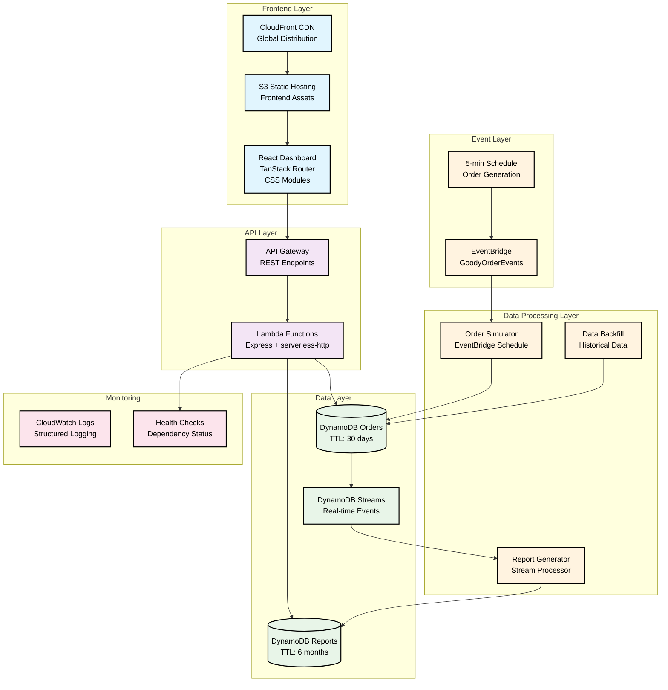
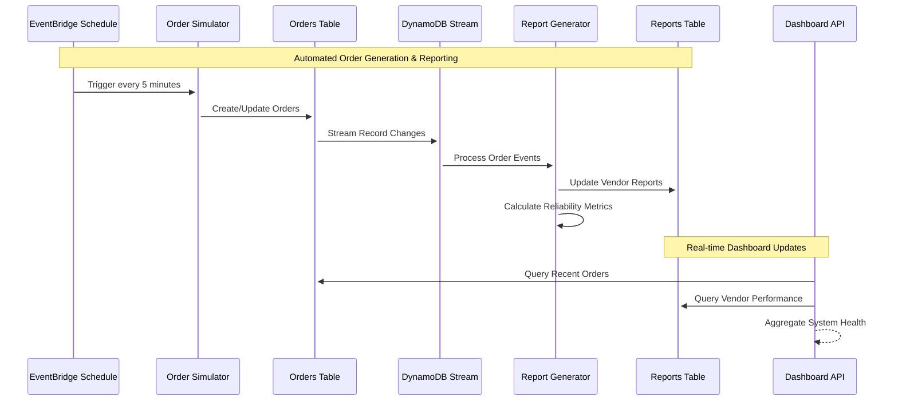
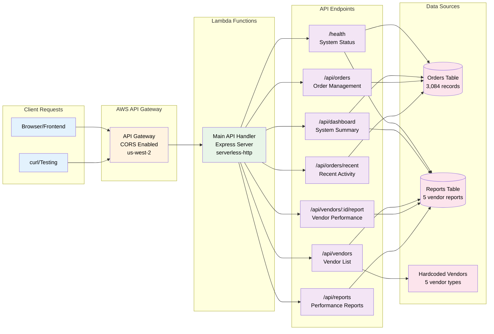
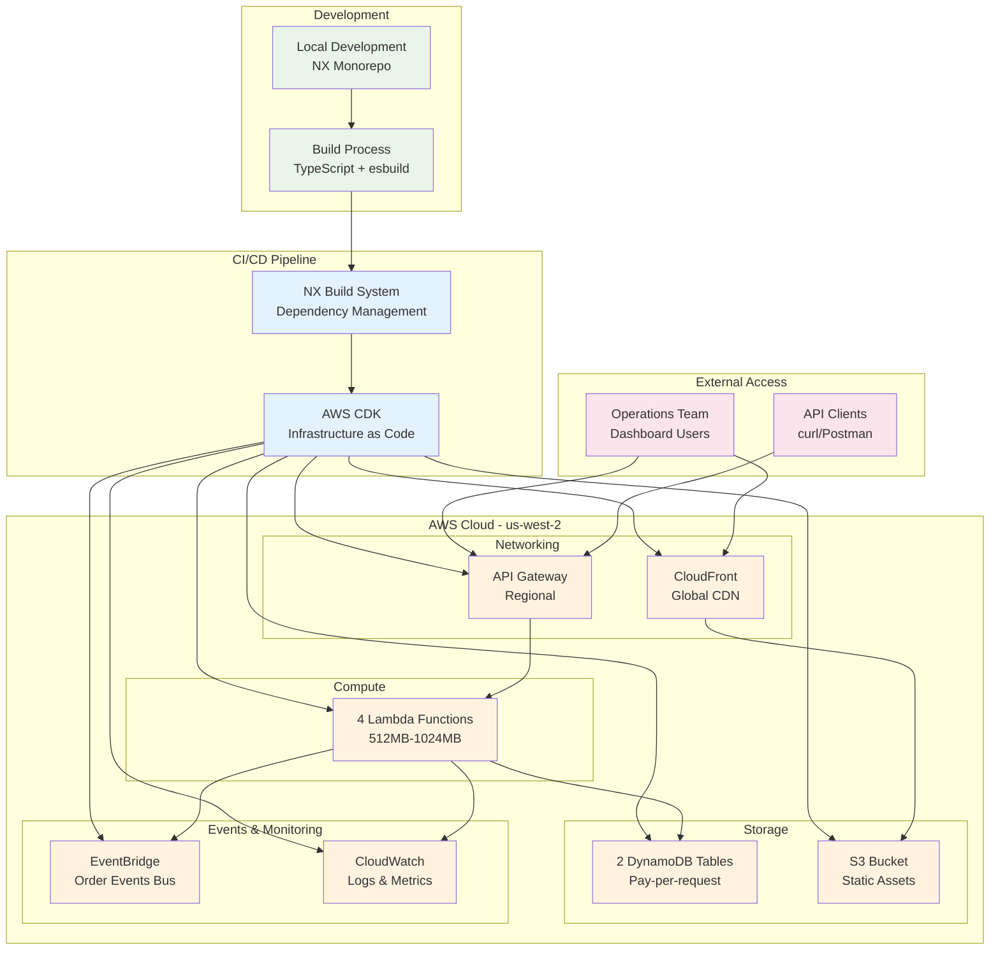
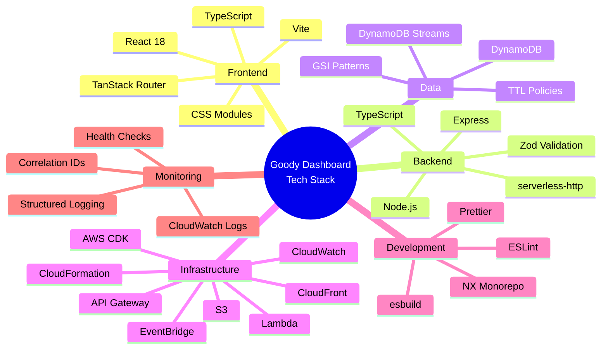

# Goody Dashboard - System Architecture

## High-Level Architecture Overview



## Event-Driven Data Flow



## API Architecture



## Database Schema & Access Patterns

### Core Tables

**Orders Table**
- Primary Key: `orderId`
- Attributes: `vendorId`, `customerId`, `status`, `createdAt`, `updatedAt`, `ttl`, `correlationId`
- GSI: `vendorIndex` (vendorId, createdAt) - for vendor-specific queries
- GSI: `statusIndex` (status, updatedAt) - for status-based filtering
- TTL: 30 days retention

**Reports Table**
- Primary Key: `vendorId`
- Sort Key: `date`
- Attributes: `totalOrders`, `arrivedOrders`, `reliability`, `recentIssues`, `ttl`, `createdAt`
- TTL: 6 months retention

**Vendors (Hardcoded)**
- Static data: `vendorId`, `name`, `category`, `baseReliability`
- 5 vendor types: Premium Flowers, Tech Gadgets, Gourmet Food, Artisan Crafts, Books & Media

### Query Patterns
- **Dashboard Summary**: Scan Reports table for all vendor performance
- **Vendor Performance**: Query Reports by vendorId for specific vendor details
- **Recent Orders**: Query Orders statusIndex for latest activity
- **Order History**: Query Orders vendorIndex for vendor-specific order history
- **Health Check**: Count operations on both tables for system status

### Data Flow
```
Orders → DynamoDB Stream → Report Generator → Reports Table
```

## Deployment Architecture



## Technology Stack



## Key Architectural Decisions

### Event-Driven Architecture
- **DynamoDB Streams** trigger real-time report generation
- **EventBridge** orchestrates order simulation and processing
- **Serverless** architecture with automatic scaling

### Data Retention Strategy
- **Orders**: 30-day TTL for operational data
- **Reports**: 6-month TTL for historical analysis
- **Vendors**: Persistent master data

### Performance Optimization
- **GSI Patterns** for efficient DynamoDB queries
- **CDN Distribution** via CloudFront
- **Lambda Cold Start Mitigation** with proper memory allocation

### Operational Excellence
- **Correlation IDs** for request tracing
- **Structured Logging** for debugging
- **Health Checks** for system monitoring
- **Infrastructure as Code** for reproducible deployments

## Live System Details

- **API Gateway**: https://6q0ywxpbhh.execute-api.us-west-2.amazonaws.com/prod/
- **CloudFront**: https://d1fkw11r9my6ok.cloudfront.net
- **Stack ARN**: arn:aws:cloudformation:us-west-2:129013835758:stack/GoodyDashboardStack/8573eb10-5b3b-11f0-8dc0-02723cabd28d
- **Region**: us-west-2
- **Resources**: 42 AWS resources deployed
- **Data**: 3,084 orders, 5 vendor reports generated