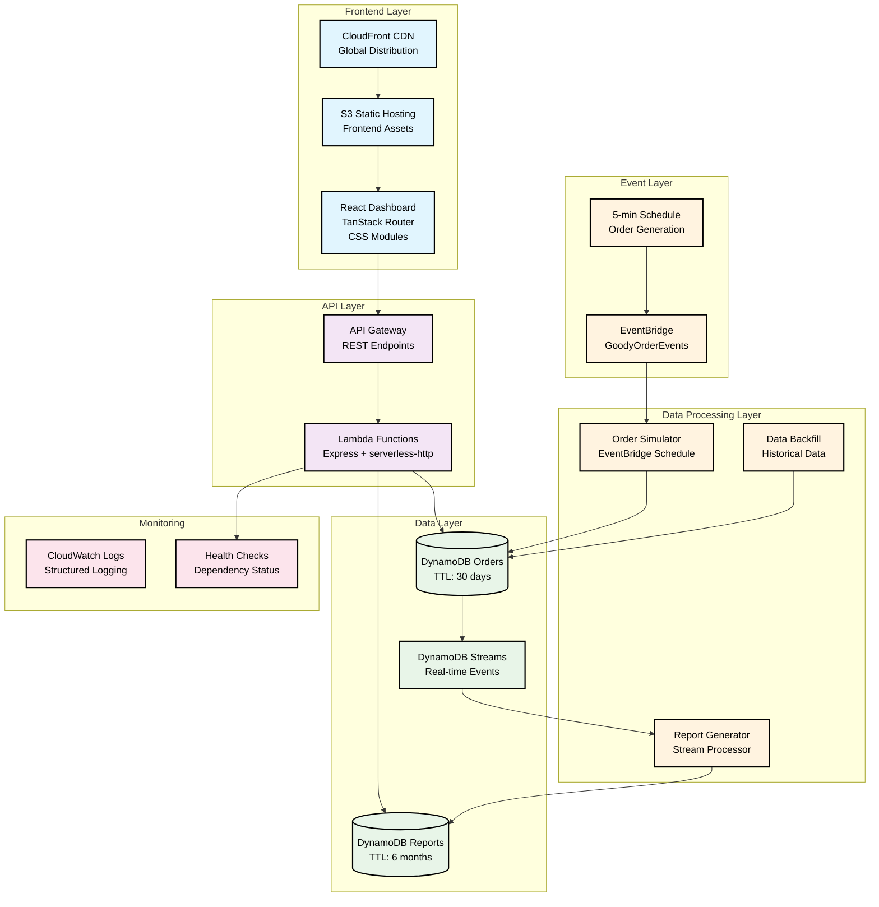

# Demo Script: Goody Third-Party Gift Fulfillment Health Dashboard

1. Introduction (1 minute)
2. Live Demo (2 minutes)
3. Technical Architecture & Implementation (1 minute)
4. Conclusion & Why Goody (1 minute)

## 1. Introduction (1 minute)
1. Hey Mark and the team at Goody, I'm Liam. I'm a hands-on Software Engineer with 14 years of experience and a track record of exceptional impact.
2. I'd love to work in Engineering at Goody.
3. Instead of sending a resume, I've built a functional demo that showcases both my technical skills and my understanding of the operational challenges that face Goody.
4. I've created a Third-Party Gift Fulfillment Health Dashboard that addresses a critical challenge faced by companies like Goody: maintaining visibility into vendor performance to contain fulfillment issues before they broadly impact customer experience.
5. In a line of business where third-party vendor reliability directly impacts customer satisfaction and brand reputation, this dashboard enables operations teams to monitor vendor health, identify performance degradation, and proactively manage vendor relationships.
6. I completed this end-to-end implementation in just one day, demonstrating my ability to rapidly deliver new capabilities.

## 2. Live Demo (2 minutes)
1. **Dashboard Overview**:
   - System Health
   - Highlighted key metrics (Reliability, At Risk Vendors)

2. **Vendor Details**
   - Real-time metrics contextualized to the vendor
   - Breakdown of concerning statuses
   - Recent order view filtered to just this vendor

3. **Recent Orders and Order Search**:
   - Event-driven architecture means that this shows a real time feed of order updates

4. Crawl/Walk/Run
   1. Crawl: Do we have problematic vendors? Do we see recurring types of issue?
   2. Walk: Let's target a few vendors for improvement, write down some thresholds
   3. Run: Let's automatically delist vendors with intolerably poor performance

5. Try it out CTA

## 3. Technical Architecture & Implementation (1 minute)

1. **Frontend**: React with TypeScript
2. **API**: Node.js Express APIs running on AWS Lambda with serverless-http for scalable operations
3. **Order Simulating**: Node.Js lambda running on a 5 minute schedule make changes to the data layer
4. **Order Storage**: DynamoDB tables for orders and reports with TTL-based retention
5. **Report Generation**: DynamoDB Streams trigger real-time report generation
6. **Backfill**: NodeJS Lambda generates 3 weeks of data
7. **Infrastructure**: CDK

I focused on building a cloud-native, event-driven solution that demonstrates both rapid delivery capability and production engineering standards, which I believe is necessary to succeed in a startup environment.

## 4. Conclusion & Why I'm a fit for Goody (1 minute)
1. **Why I'm a fit for Goody**:
   - I've showcased expertise in cloud-native architecture, event-driven systems, and full-stack development with modern best practices
   - I've demonstrated my ability to use engineering empirically. We need to be able to answer questions in order to justify next steps.
   - I've proven my ability to rapidly deliver production-quality solutions by leveraging AI.
   - I believe I wouldn't simply meet the bar at Goody, I will raise it

2. **Why I'm excited about Goody**:
   - I'm interested in working at a company that does good in the world.
   - I want to work in a high-paced environment where I can deliver extraordinary value with little red tape.
   - I believe I can accomplish my major learning goals while delivering exceptional impact on systems that real people use

3. I'm excited about the possibility of joining Goody and contributing to your mission of enabling meaningful human connection at scale.
4. Thank you for your consideration. I look forward to hearing back.
